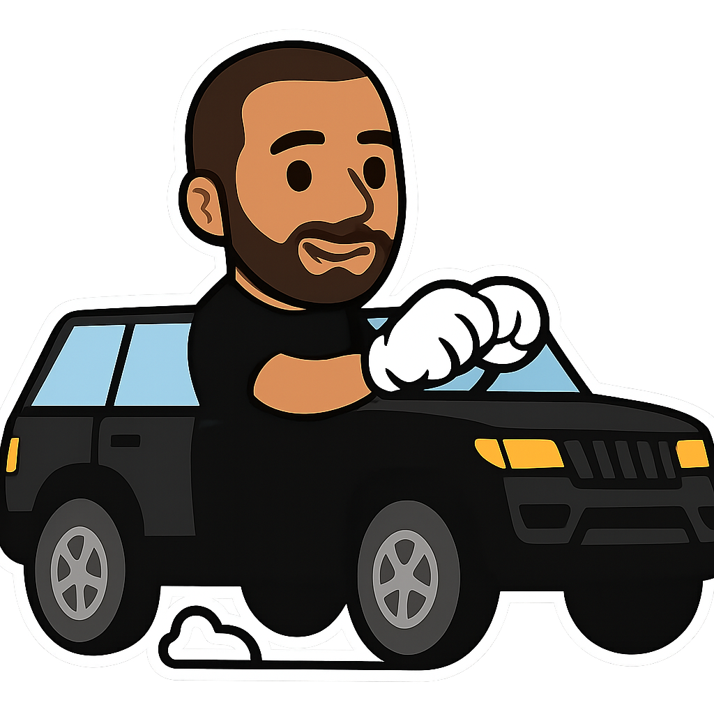

<!DOCTYPE html>
<html lang="en">
<head>
    <meta charset="UTF-8">
    <meta name="viewport" content="width=device-width, initial-scale=1.0">
    <title>Happy Birthday Card</title>
    <link href="https://fonts.googleapis.com/css2?family=Press+Start+2P&display=swap" rel="stylesheet">
    
</head>
<body>
    <!-- Intro Page -->
    

        <h1 class="title">Do you want to receive your gift? 🎁</h1>
        <button id="yes-button" class="yes-button">Yes ✅</button>
        <button id="no-button" class="no-button" style="top: 60%; left: 55%;">No ❌</button>
    

    <!-- Gift Page -->
    

        <!-- Background Clouds -->
        
☁️ ☁️ ☁️

        
☁️ ☁️

        <!-- Track Line -->
        

            

        

        <!-- Coins -->
        
🪙

        
🪙

        
🪙

        
🪙

        
🪙

        <!-- Birthday Title -->
        <h1 class="gift-title">🎉 Happy Birthday, Bro! 🎉</h1>

        <!-- Animated Range Rover -->
        
        

        

            Here's your  gift — a custom Range Rover ride 🚙💨
        

    

    
</body>
</html>
